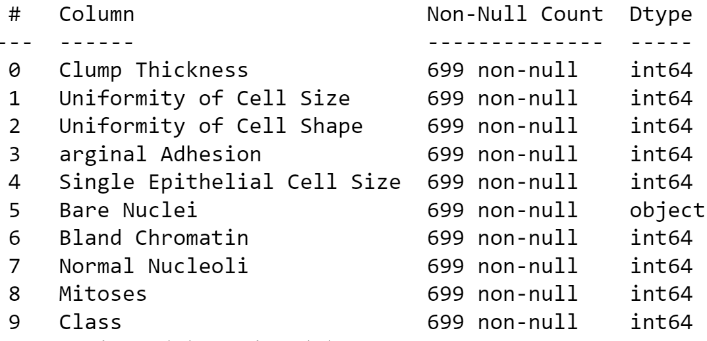

# Diagnostic of Breast Cancer. Does the diagnostic indicates benign or malignant ?

## Author
Hossam Fattah

## Executive summary
The purpose of this machine learning project is to diagnose breast cancer from a Fine Needle Aspiration (FNA) of a breast mass. Ten assessed characteristics of an FNA sample relevant to diagnosis is used to predict whether there is a breast cancer or not. A high-quality dataset is used which contains different features for diagnosing breast cancer.

Features are computed from a digitized image of a fine needle aspirate (FNA) of a breast mass. They describe characteristics of the cell nuclei present in the image. A classification method will be used to determine whether the cancer is malignant or benign.
The following features are collected for each cell nucleus:
1. Sample code number            id number
2. Clump Thickness               1 - 10
3. Uniformity of Cell Size       1 - 10
4. Uniformity of Cell Shape      1 - 10
5. Marginal Adhesion             1 - 10
6. Single Epithelial Cell Size   1 - 10
7. Bare Nuclei                   1 - 10
8. Bland Chromatin               1 - 10
9. Normal Nucleoli               1 - 10
10. Mitoses                      1 - 10
11. Class: 		                    (0 for benign, 1 for malignant)

## Datasource and Dataset
A high-quality dataset from a university medical hospital is used and will come from the UCI Machine Learning repository.
Question to answer
To predict based on a breast cancer sample whether the breast cancer is malignant or benign.

## Methodology
Supervised and unsupervised learning methods will be used; includes but not limited to: K-nearest neighbors, logistic regression, decision trees, and support vector machines)
I will be using a realistic and high-quality dataset and data analysis to investigate the data, using different ML models, and compare how to predict the breast cancer, whether it is malignant or benign, with maximum accuracy.

## Research Question
Does the breast cancer diagnostic indicates benign or malignant ?

## Importance of this Predictive ML
Breast cancer is a dangerous disease with a high morbidity and mortality rate. One of the most important aspects in breast cancer treatment is getting an accurate diagnosis. Machine-learning (ML) techniques can help doctors in making diagnosis decisions. We will develop an accurate ML model to help health care professional and patient in early diagnostics of breast cancer and early treatment.

## Deliverables

The Jupyter notebook is available here:
[Jupyter Notebook](https://github.com/hossamfattah/capstone/blob/master/MyWorkF.ipynb)

## Installation of Packages
To run the above Jupyter notebook, make sure to install all necessary packages on your local machine.

Especially, you need to install "kaleido" engine which requires the kaleido package,
which can be installed using pip:
    $ pip install -U kaleido

## Discussion and Results
I read the dataset and started to explore it. I used info() to see what columns and data types is each column

I plotted the count plot of classes ( 0 is bengin and 1 is malignant).

I plotted the heatmap coufor Class vs, "Clump Thickness" ( 0 is bengin and 1 is malignant).

I plotted the histogram for all features and target ( 0 is bengin and 1 is malignant).

I found the correlation among features and target. The following fours features are the top most important four features that influnce whether the cancer is bengin or malignant

-Bare Nuclei

-Uniformity of Cell Shape

-Uniformity of Cell Size

I divided the datset into training and test sets.

I used a pipeline with polynomial features and linear regression. I plotted the MSE for training and test sets vs. degree of the polynomial.
I found that degree=2  yeild the lowest test MSE

I ran a GridSearchCV to final optimal parameters for this pipeline with scoring='neg_mean_squared_error'. The following are data and permutation importance.

The best Poly degree is:  2.00

Elapsed during training: 0.0264s

Test score is:  0.43

Score is:  0.85

MSE is:  0.04

----------------
Bare Nuclei 0.371 +/- 0.023

Uniformity of Cell Size 0.215 +/- 0.020

Clump Thickness 0.077 +/- 0.007

Uniformity of Cell Shape 0.053 +/- 0.006

Bland Chromatin 0.040 +/- 0.005

Normal Nucleoli 0.039 +/- 0.005

arginal Adhesion  0.029 +/- 0.004

Mitoses  0.013 +/- 0.002

Single Epithelial Cell Size 0.007 +/- 0.001

I used a pipeline with StandardScaler and Ridge model. I ran a GridSearchCV to final optimal parameters for this pipeline. The following are data, Ridge coefficient, and permutation importance.

Elapsed during training: 0.0072s

Test score is:  0.79

Score is:  0.80

MSE is:  0.05

Best param: {'ridge__alpha': 28.828282828282827}

                  Feature name     Ridge coeff

5                  Bare Nuclei     0.157969

0              Clump Thickness     0.080139

1      Uniformity of Cell Size     0.064746

2     Uniformity of Cell Shape     0.064479

6              Bland Chromatin     0.057440

7              Normal Nucleoli     0.054117

3            arginal Adhesion      0.020697

8                      Mitoses     0.009651

4 Single Epithelial Cell Size     0.004428

--------------------------------------
Bare Nuclei 0.233 +/- 0.017

Clump Thickness 0.058 +/- 0.006

Uniformity of Cell Size 0.038 +/- 0.006

Uniformity of Cell Shape 0.037 +/- 0.006

Bland Chromatin 0.031 +/- 0.005

Normal Nucleoli 0.028 +/- 0.004

arginal Adhesion  0.004 +/- 0.002

Mitoses  0.001 +/- 0.001

Single Epithelial Cell Size 0.000 +/- 0.000

I used a pipeline with SequentialFeatureSelector and Lasso model. I ran a GridSearchCV to final optimal parameters for this pipeline. The following are data, Lasso coefficient, and permutation importance.

Best param to select: {'lasso__alpha': 0.042222222222222223, 'selector__n_features_to_select': 8}

Elapsed during training: 0.3068s

Test score is:  0.79

Score is:  0.79

MSE is:  0.04

                  Feature name  Lasso coeff

5                  Bare Nuclei     0.049605

0              Clump Thickness     0.025731

1      Uniformity of Cell Size     0.025115

2     Uniformity of Cell Shape     0.021572

7              Normal Nucleoli     0.018110

6              Bland Chromatin     0.016190

3            arginal Adhesion      0.002132

4  Single Epithelial Cell Size     0.000000

------------
Bare Nuclei 0.311 +/- 0.021

Uniformity of Cell Size 0.063 +/- 0.007

Clump Thickness 0.053 +/- 0.005

Uniformity of Cell Shape 0.045 +/- 0.006

Normal Nucleoli 0.033 +/- 0.005

Bland Chromatin 0.020 +/- 0.004

Single Epithelial Cell Size 0.000 +/- 0.000

arginal Adhesion  0.000 +/- 0.000

I used clustering model to classify data. I used two fetaures, 'Bare Nuclei','Clump Thickness'. Clustering is visible based on these two features.

I repeated clustering model with two features, 'Uniformity of Cell Shape','Uniformity of Cell Size'. Clustering is visible based on these two features.

I used a pipeline with StandardScaler and KNeighborsClassifier. I ran a GridSearchCV to final optimal parameters for this pipeline. The following are scores, best n_neighbors, and classification report. I also plotted RoC.

Accuracy score is:  0.95

Recall score is:  0.90

Precision_score is:  0.98

The best score is:  0.90

The best n_neighbors is:  9.00

                 precision    recall  f1-score   support

      Benign       0.94       0.99       0.96        103
      
      Malignant    0.98       0.90       0.94         68

    accuracy                           0.95        171

   macro avg       0.96       0.94       0.95        171

weighted avg       0.95       0.95       0.95        171

Below, I used the RocCurveDisplay to display roc curves for three knn models. You can either use predictions or estimators to create the visualization.

I used a pipeline with StandardScaler and LogisticRegression. I ran a GridSearchCV to final optimal parameters for this pipeline. The following are scores, best C, and classification report.
I also plotted ConfusionMatrix and RoC Display.

Accuracy score is:  0.92

Recall score is:  0.81

Precision_score is:  0.98

The best score is:  1.00

The best C is:  0.01

              precision    recall  f1-score   support

      Benign       0.89      0.99      0.94       103
      
      Malignant       0.98      0.81      0.89        68

    accuracy                           0.92       171

   macro avg       0.93      0.90      0.91       171

weighted avg       0.92      0.92      0.92       171

and these are the coefficient of the LogisticRegress:

                  Feature name  Lr coeff

5                  Bare Nuclei  0.439379

0              Clump Thickness  0.350903

2     Uniformity of Cell Shape  0.342239

1      Uniformity of Cell Size  0.323581

6              Bland Chromatin  0.320776

3            arginal Adhesion   0.270543

7              Normal Nucleoli  0.269996

4  Single Epithelial Cell Size  0.224170

8                      Mitoses  0.149162

I used a pipeline with DecisionTreeClassifier. I ran a GridSearchCV to final optimal parameters for this pipeline. The following are scores, best parameters, and classification report.

Accuracy score is:  0.96

Recall score is:  0.94

Precision_score is:  0.97

The best score is:  0.96

The best param is: {'criterion': 'gini', 'max_depth': 5, 
'min_samples_leaf': 5, 'min_samples_split': 5}

The best score is: 0.964820102798401

              precision    recall  f1-score   support

      Benign       0.96      0.98      0.97       103
      
      Malignant       0.97      0.94      0.96        68

    accuracy                           0.96       171

   macro avg       0.97      0.96      0.96       171

weighted avg       0.97      0.96      0.96       171

I used a pipeline with SVC. I ran a GridSearchCV to final optimal parameters for this pipeline. The following are scores, best parameters, and classification report.

Accuracy score is:  0.95

Recall score is:  0.90

Precision_score is:  0.97

The best score is:  0.95

The best param is: {'kernel': 'rbf'}

The best score is: 0.9687607081667619

              precision    recall  f1-score   support

      Benign       0.94      0.98      0.96       103
      
      Malignant       0.97      0.90      0.93        68

    accuracy                           0.95       171

   macro avg       0.95      0.94      0.94       171

weighted avg       0.95      0.95      0.95       171

I summarized all results from different supervised and unsupervised ML models as in this Table:

From these results, they show that Knn and SVC have the highest score while the lowest fit time.

# Conclusions 
The classification goal is to predict if the breast cancer is benign or malignant.

WoW!. I found that the Decision tree classifier, K-neighbors, and SVC are the top best models to use and they provide the best accuracy of 0.97, 0.95, 0.98 respectively. Their fit time is the lowest as well.

The following four features are the top most important features to determine whether a cancer is benign or malignant:

Bare Nuclei-

-Uniformity of Cell Size

-Clump Thickness

-Uniformity of Cell Shape
